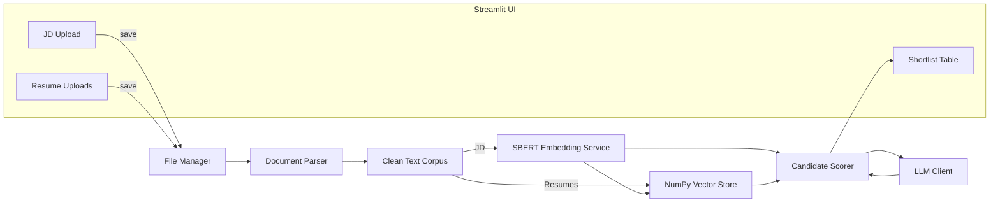

# Resume Screening AI Agent

Production-ready Streamlit application that scores and shortlists resumes against a job description using local SentenceTransformers embeddings, Ollama-powered LLM reasoning, and a lightweight NumPy vector store.

## Overview
Developed by: Srinivas B N  
College: RNSIT, Bengaluru  
Branch: CSE-AIML (2026)  
For: Rooman 48-Hour AI Agent Challenge

## Key Features
- Upload JD + multiple resumes (PDF/TXT)
- pdfplumber-based parsing with whitespace normalization
- Local SBERT embeddings persisted in NumPy for fast cosine similarity
- Skill and experience heuristics layered on top of similarity scoring
- Ollama-generated strengths, weaknesses, and reasoning per candidate
- Downloadable shortlist CSV + detailed expandable insights
- Modular architecture with logging, error handling, and persistent storage

## Architecture


## Project Structure
```
app/
  main.py              # Streamlit entrypoint
  embeddings/          # Embedding + vector-store management
  parsing/             # File parsing utilities
  prompts/             # Prompt templates
  ranking/             # Scoring + ranking logic
  utils/               # Logging, file IO, LLM client, helpers
  storage/             # Local persistence (uploads + vectors)
requirements.txt
README.md
```

## Setup
1. **Python**: 3.10+ recommended.
2. **Install deps**
   ```bash
   pip install -r requirements.txt
   ```

## Run Locally (Free Stack: Ollama + SBERT)
1. **Install Ollama**: https://ollama.com (desktop app or CLI).
2. **Start Ollama**: launch the desktop app or run `ollama serve`.
3. **Pull a lightweight model**:
   ```bash
   ollama pull gemma3:1b
   ```
4. **Create virtualenv + install**:
   ```powershell
   python -m venv venv
   .\venv\Scripts\Activate.ps1
   pip install -r requirements.txt
   ```
5. *(Optional)* Point to a custom Ollama instance/model:
   ```powershell
   $env:OLLAMA_URL = "http://127.0.0.1:11434/api/generate"
   $env:OLLAMA_MODEL = "gemma3:1b"
   ```
6. **Run Streamlit**:
   ```bash
   streamlit run app/main.py
   ```

The app no longer requires an OpenAI key—everything runs against the local Ollama server and SentenceTransformers embeddings.

## Deployment (Streamlit Cloud)
1. Push repo to GitHub.
2. Create Streamlit Cloud app pointing to `app/main.py`.
3. Provide a reachable Ollama endpoint via secrets:
   - `OLLAMA_URL` (e.g., `https://your-ollama-host/api/generate`)
   - `OLLAMA_MODEL` (optional override)
4. The bundled NumPy vector store persists per session; replace with managed storage if required.

## Logging & Storage
- Logs live under `app/storage/app.log` (rotating handler, 1 MB per file).
- Uploaded files + generated artifacts live under `app/storage/uploads`.
- Vector embeddings stored in `app/storage/chroma`.

## Testing the Flow
1. Upload JD PDF/TXT.
2. Upload multiple resume PDFs/TXTs.
3. Click **Run Screening**.
4. Review shortlist table + expandable cards.
5. `Download Shortlist (CSV)` for offline review.

## Limitations
- Requires Ollama + the specified model to be running locally before screening.
- Currently supports only PDF and TXT inputs; complex layouts may degrade extraction.
- Skill detection relies on a predefined dictionary and may miss niche competencies.
- Vector store persists locally (NumPy + JSON); shared deployments need external storage.

## Future Improvements
- Support additional file formats (DOCX, HTML) with fallback parsers.
- Integrate resume parsing (e.g., names, contact info) via NLP tagging.
- Add skill taxonomy customization with user-provided keywords.
- Introduce feedback loop storing reviewer decisions for model tuning.
- Extend deployment scripts (Dockerfile, CI workflow) for enterprise rollouts.

