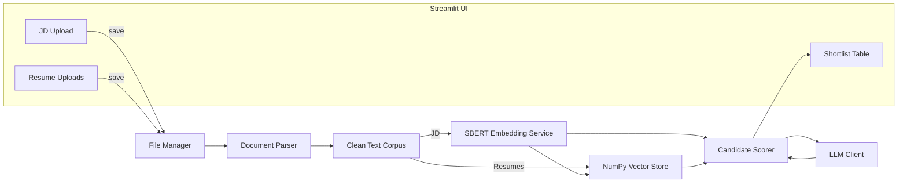

# Resume Screening AI Agent

## 📖 Abstract

Resume Screening AI Agent is a production-ready Streamlit application that intelligently scores and shortlists resumes against job descriptions using local SentenceTransformers embeddings, Ollama-powered LLM reasoning, and a lightweight NumPy vector store. The system combines semantic similarity matching with skill and experience heuristics to provide comprehensive candidate evaluation with detailed strengths, weaknesses, and reasoning for each applicant. This project demonstrates advanced NLP techniques, AI agent architecture, and practical HR automation solutions.

---

<table>
<tr>
<td width="50%" valign="top">

## 🛠️ Tech Stack

| Layer | Technology |
|-------|------------|
| Framework | Streamlit |
| LLM | Ollama (Gemma3:1b) |
| Embeddings | SentenceTransformers (SBERT) |
| Vector Store | NumPy + JSON |
| Document Parsing | pdfplumber |
| Language | Python 3.10+ |
| Storage | Local File System |

</td>
<td width="50%" valign="top">

## 📌 Project Summary

| Section | Details |
|--------:|---------|
| **Project Name** | Resume Screening AI Agent |
| **Developer** | Srinivas B N |
| **College** | RNSIT, Bengaluru |
| **Branch** | CSE-AIML (2026) |
| **Challenge** | Rooman 48-Hour AI Agent Challenge |
| **Stack** | Local Ollama + SBERT (Free) |
| **Purpose** | Automated resume screening and ranking |

</td>
</tr>
</table>

---

## ✅ Features

<table>
<tr>
<td width="33%" valign="top">

### Core Functionality
- Upload JD + multiple resumes (PDF/TXT)
- pdfplumber-based parsing
- Whitespace normalization
- Local SBERT embeddings
- Cosine similarity matching
- Skill detection heuristics
- Experience evaluation

</td>
<td width="33%" valign="top">

### AI-Powered Analysis
- Ollama LLM integration
- Candidate strengths analysis
- Weakness identification
- Detailed reasoning per candidate
- Semantic similarity scoring
- Multi-layer ranking algorithm
- Context-aware evaluation

</td>
<td width="33%" valign="top">

### Output & Storage
- Downloadable shortlist CSV
- Expandable candidate cards
- Persistent NumPy vector store
- Modular architecture
- Comprehensive logging
- Error handling system
- Session-based storage

</td>
</tr>
</table>

---

## 🎯 Current Outcome

This project currently contains:
- ✔ Production-ready Streamlit application
- ✔ Local Ollama + SBERT integration (no API costs)
- ✔ Multi-resume batch processing
- ✔ Intelligent ranking algorithm
- ✔ Detailed candidate insights
- ✔ CSV export functionality
- ✔ Modular and extensible codebase

---

## 🚀 Quick Start Guide

### 1️⃣ Clone Repo
```bash
git clone https://github.com/SRINIVASBN/Resume-Screening-AI-Agent.git
cd Resume-Screening-AI-Agent
```

### 2️⃣ Install Ollama
1. Download Ollama from [https://ollama.com](https://ollama.com)
2. Install and start Ollama:
```bash
ollama serve
```
3. Pull the Gemma3 model:
```bash
ollama pull gemma3:1b
```

### 3️⃣ Setup Python Environment
```bash
# Create virtual environment
python -m venv venv

# Activate (Windows)
.\venv\Scripts\Activate.ps1

# Activate (Mac/Linux)
source venv/bin/activate

# Install dependencies
pip install -r requirements.txt
```

### 4️⃣ Configure Environment (Optional)
```bash
# Windows PowerShell
$env:OLLAMA_URL = "http://127.0.0.1:11434/api/generate"
$env:OLLAMA_MODEL = "gemma3:1b"

# Mac/Linux
export OLLAMA_URL="http://127.0.0.1:11434/api/generate"
export OLLAMA_MODEL="gemma3:1b"
```

### 5️⃣ Run the Application
```bash
streamlit run app/main.py
```

---

## 🏗️ Architecture


---

## 📁 Project Structure
```
Resume-Screening-AI-Agent/
├── app/
│   ├── main.py              # Streamlit entrypoint
│   ├── embeddings/          # Embedding + vector-store management
│   ├── parsing/             # File parsing utilities
│   ├── prompts/             # Prompt templates
│   ├── ranking/             # Scoring + ranking logic
│   ├── utils/               # Logging, file IO, LLM client, helpers
│   └── storage/             # Local persistence
│       ├── uploads/         # Uploaded files
│       ├── chroma/          # Vector embeddings
│       └── app.log          # Application logs
├── requirements.txt         # Python dependencies
└── README.md               # Documentation
```

---

## 🔧 How It Works

### Step 1: Document Upload & Parsing
- Users upload Job Description (JD) and multiple resumes
- pdfplumber extracts text with whitespace normalization
- Documents are cleaned and preprocessed

### Step 2: Embedding Generation
- Local SentenceTransformers (SBERT) generates embeddings
- Embeddings stored in NumPy-based vector store
- Fast cosine similarity computation

### Step 3: Candidate Scoring
- Multi-layer scoring algorithm:
  - Semantic similarity matching
  - Skill detection heuristics
  - Experience evaluation
- Weighted scoring system

### Step 4: LLM Analysis
- Ollama generates detailed insights:
  - Candidate strengths
  - Areas of improvement
  - Reasoning for scores
- Context-aware evaluation

### Step 5: Results & Export
- Ranked shortlist displayed in table
- Expandable cards with detailed insights
- Downloadable CSV for offline review

---

## 🎨 Key Components

<table>
<tr>
<td width="33%" valign="top">

### Document Processing
- **Parser**: pdfplumber-based extraction
- **Normalization**: Whitespace cleaning
- **Format Support**: PDF, TXT
- **Error Handling**: Graceful fallbacks

</td>
<td width="33%" valign="top">

### AI & Embeddings
- **Model**: SentenceTransformers (SBERT)
- **LLM**: Ollama Gemma3:1b
- **Similarity**: Cosine similarity
- **Storage**: NumPy vector store

</td>
<td width="33%" valign="top">

### Scoring Algorithm
- **Layer 1**: Semantic similarity
- **Layer 2**: Skill matching
- **Layer 3**: Experience heuristics
- **Output**: Weighted composite score

</td>
</tr>
</table>

---

## ☁️ Deployment (Streamlit Cloud)

### 1️⃣ Push to GitHub
```bash
git push origin main
```

### 2️⃣ Create Streamlit Cloud App
1. Go to [share.streamlit.io](https://share.streamlit.io)
2. Connect your GitHub repository
3. Set main file path: `app/main.py`

### 3️⃣ Configure Secrets
Add to Streamlit Cloud secrets:
```toml
OLLAMA_URL = "https://your-ollama-host/api/generate"
OLLAMA_MODEL = "gemma3:1b"
```

### 4️⃣ Deploy
Click "Deploy" and your app will be live!

---

## 📊 Testing the Flow

1. **Upload JD**: Upload job description (PDF/TXT)
2. **Upload Resumes**: Add multiple candidate resumes
3. **Run Screening**: Click "Run Screening" button
4. **Review Results**: Examine shortlist table
5. **Expand Cards**: View detailed candidate insights
6. **Download CSV**: Export results for offline review

---

## 🔒 Logging & Storage

### Application Logs
- Location: `app/storage/app.log`
- Rotation: 1 MB per file
- Format: Timestamped with log levels

### File Storage
- **Uploads**: `app/storage/uploads/`
- **Vectors**: `app/storage/chroma/`
- **Artifacts**: Session-based persistence

---

## ⚠️ Limitations

- **Ollama Dependency**: Requires local Ollama instance running
- **File Formats**: Currently supports PDF and TXT only
- **Layout Complexity**: Complex PDF layouts may degrade extraction
- **Skill Detection**: Based on predefined dictionary
- **Vector Store**: Local persistence (not suitable for multi-user deployments)

---

## 🚀 Future Improvements

- **File Format Support**: Add DOCX, HTML with fallback parsers
- **Resume Parsing**: Extract names, contact info via NLP tagging
- **Skill Taxonomy**: User-customizable keyword library
- **Feedback Loop**: Store reviewer decisions for model tuning
- **Enterprise Features**: Dockerfile, CI/CD workflows
- **Cloud Storage**: Migrate to managed vector databases
- **Multi-language Support**: International resume screening
- **Advanced Analytics**: Dashboard with hiring metrics

---

## 🤝 Contributing

Contributions are welcome! Please feel free to submit a Pull Request.

---

## 👨‍💻 Author

**SRINIVAS BN**  
CSE-AIML (2026)  
RNSIT, Bengaluru

---

